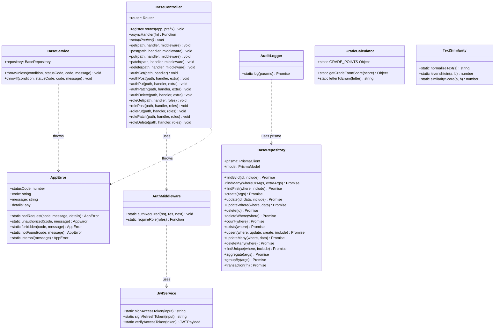
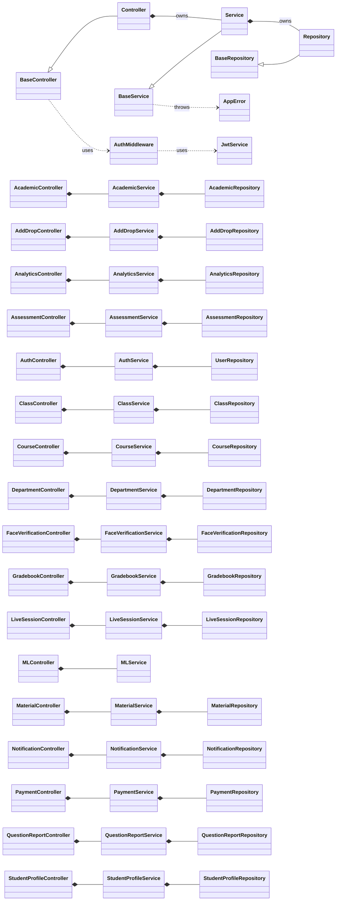

# Lucy LMS Backend - Class Diagram

## Full Architecture

```mermaid
classDiagram
    direction TB

    class AppError {
        +statusCode: number
        +code: string
        +message: string
        +details: any
        +static badRequest(code, message, details) AppError
        +static unauthorized(code, message) AppError
        +static forbidden(code, message) AppError
        +static notFound(code, message) AppError
        +static internal(message) AppError
    }

    class BaseController {
        +router: Router
        +registerRoutes(app, prefix) void
        +asyncHandler(fn) Function
        +setupRoutes() void*
        +get(path, handler, middleware) void
        +post(path, handler, middleware) void
        +put(path, handler, middleware) void
        +patch(path, handler, middleware) void
        +delete(path, handler, middleware) void
        +authGet(path, handler) void
        +authPost(path, handler, extra) void
        +authPut(path, handler, extra) void
        +authPatch(path, handler, extra) void
        +authDelete(path, handler, extra) void
        +roleGet(path, handler, roles) void
        +rolePost(path, handler, roles) void
        +rolePut(path, handler, roles) void
        +rolePatch(path, handler, roles) void
        +roleDelete(path, handler, roles) void
    }

    class BaseRepository {
        +prisma: PrismaClient
        +model: PrismaModel
        +findById(id, include) Promise
        +findMany(whereOrArgs, extraArgs) Promise
        +findFirst(where, include) Promise
        +create(args) Promise
        +update(id, data, include) Promise
        +updateWhere(where, data) Promise
        +delete(id) Promise
        +deleteWhere(where) Promise
        +count(where) Promise
        +exists(where) Promise
        +upsert(where, update, create, include) Promise
        +updateMany(where, data) Promise
        +deleteMany(where) Promise
        +findUnique(where, include) Promise
        +aggregate(args) Promise
        +groupBy(args) Promise
        +transaction(fn) Promise
    }

    class BaseService {
        +repository: BaseRepository
        +throwUnless(condition, statusCode, code, message) void
        +throwIf(condition, statusCode, code, message) void
    }

    class JwtService {
        +static signAccessToken(input) string
        +static signRefreshToken(input) string
        +static verifyAccessToken(token) JWTPayload
    }

    class AuthMiddleware {
        +static authRequired(req, res, next) void
        +static requireRole(roles) Function
    }

    class AuditLogger {
        +static log(params) Promise
    }

    class GradeCalculator {
        +static GRADE_POINTS Object
        +static getGradeFromScore(score) Object
        +static letterToEnum(letter) string
    }

    class TextSimilarity {
        +static normalizeText(s) string
        +static levenshtein(a, b) number
        +static similarityScore(a, b) number
    }

    BaseController ..> AuthMiddleware : uses
    BaseController ..> AppError : throws
    BaseService ..> AppError : throws
    AuthMiddleware ..> JwtService : uses
    AuditLogger ..> BaseRepository : uses prisma
```

## Repositories

```mermaid
classDiagram
    direction TB

    class BaseRepository {
        +prisma: PrismaClient
        +model: PrismaModel
        +findById(id, include) Promise
        +findMany(whereOrArgs, extraArgs) Promise
        +findFirst(where, include) Promise
        +create(args) Promise
        +update(id, data, include) Promise
        +updateWhere(where, data) Promise
        +delete(id) Promise
        +deleteWhere(where) Promise
        +count(where) Promise
        +exists(where) Promise
        +upsert(where, update, create, include) Promise
        +updateMany(where, data) Promise
        +deleteMany(where) Promise
        +findUnique(where, include) Promise
        +aggregate(args) Promise
        +groupBy(args) Promise
        +transaction(fn) Promise
    }

    class AcademicRepository {
        +findByYear(yearId)
        +findByDepartment(deptId)
        +findCurrentSemester()
    }

    class AddDropRepository {
        +findByStudent(studentId)
        +findBySemester(semesterId)
    }

    class AnalyticsRepository {
        +getDashboardData()
        +getCourseData(courseId)
        +getStudentData(studentId)
    }

    class AssessmentRepository {
        +findWithCourseAndQuestions(id)
        +findWithAccessCheck(courseId)
        +findByCourseSection(courseSectionId)
    }

    class AttemptRepository {
        +findByStudentAndAssessment(studentId, assessmentId)
        +findWithAnswers(attemptId)
    }

    class ClassRepository {
        +findWithStudents(classId)
        +findWithCourses(classId)
        +findByTeacher(teacherId)
    }

    class CourseRepository {
        +findWithSections(courseId)
        +findByDepartment(deptId)
    }

    class DepartmentRepository {
        +findWithClasses(deptId)
        +findWithCourses(deptId)
    }

    class FaceVerificationRepository {
        +findByUser(userId)
        +findPending()
    }

    class GradebookRepository {
        +findBySection(sectionId)
        +findGradeEntry(id)
    }

    class LiveSessionRepository {
        +findByCourse(courseId)
        +findByCourseAndClass(courseId, classId)
        +findWithAccess(sessionId)
    }

    class MaterialRepository {
        +findByCourse(courseId)
        +findForPreview(id)
        +findForFile(id)
        +findForHtml(id)
        +findForProgress(id)
        +findWithStats(courseId)
    }

    class NotificationRepository {
        +getPendingCounts()
        +findForStudent(userId)
        +markAsRead(id, userId)
        +markAllAsRead(userId)
        +createNotification(data)
    }

    class PaymentRepository {
        +findCompletedPayment(studentId, semesterId)
        +findPendingPayment(studentId, semesterId)
        +findByReference(txRef)
        +findStudentPayments(studentId)
        +createPayment(data)
        +updatePayment(id, data)
    }

    class QuestionReportRepository {
        +findExistingReport(questionId, studentId)
        +createReport(data)
        +findStudentReports(userId)
        +findTeacherCourseIds(teacherId)
        +findAssessmentIdsForCourses(courseIds)
        +findTeacherReports(assessmentIds, status)
        +findWithCourse(reportId)
        +updateReport(id, data)
        +countPendingForTeacher(assessmentIds)
    }

    class QuestionRepository {
        +findByAssessment(assessmentId)
        +findWithOptions(questionId)
    }

    class StudentProfileRepository {
        +findByUserId(userId)
        +updateProfile(userId, data)
        +findDocumentByType(profileId, docType)
        +findDocument(docId)
        +deleteDocument(docId)
        +countDocuments(profileId)
        +findPending()
        +findAll(status)
        +findSingle(profileId)
        +approve(profileId, adminId)
        +reject(profileId, adminId, reason)
    }

    class UserRepository {
        +findByEmail(email)
        +findWithRole(userId)
        +findPending()
    }

    BaseRepository <|-- AcademicRepository
    BaseRepository <|-- AddDropRepository
    BaseRepository <|-- AnalyticsRepository
    BaseRepository <|-- AssessmentRepository
    BaseRepository <|-- AttemptRepository
    BaseRepository <|-- ClassRepository
    BaseRepository <|-- CourseRepository
    BaseRepository <|-- DepartmentRepository
    BaseRepository <|-- FaceVerificationRepository
    BaseRepository <|-- GradebookRepository
    BaseRepository <|-- LiveSessionRepository
    BaseRepository <|-- MaterialRepository
    BaseRepository <|-- NotificationRepository
    BaseRepository <|-- PaymentRepository
    BaseRepository <|-- QuestionReportRepository
    BaseRepository <|-- QuestionRepository
    BaseRepository <|-- StudentProfileRepository
    BaseRepository <|-- UserRepository
```

## Services

```mermaid
classDiagram
    direction TB

    class BaseService {
        +repository: BaseRepository
        +throwUnless(condition, statusCode, code, message) void
        +throwIf(condition, statusCode, code, message) void
    }

    class AcademicService {
        +repository: AcademicRepository
        +getAcademicYears()
        +createAcademicYear(data)
        +getSemesters(yearId)
        +createSemester(data)
        +getCourseSections(query)
        +createCourseSection(data)
        +getEnrollments(query)
        +createEnrollment(data)
        +deleteEnrollment(id)
        +getGrades(query)
        +createGrade(data)
        +updateGrade(id, data)
        +getMyCourses(user)
        +getAvailableCourses(user)
        +registerForSemester(user, body)
        +getMyResults(user, semesterId)
        +getMyCGPA(user)
        +getExamSchedules(user)
        +respondExamSchedule(user, id, body)
        +getTeacherSections(user)
        +getSectionStudents(sectionId)
        +getTeacherGrades(user)
        +submitGrades(user, sectionId, body)
        +syncAssessments(user, sectionId)
        +getTeacherExamSchedules(user)
        +setAddDropPeriod(semesterId, body)
        +setSemesterFee(semesterId, body)
        +publishGrades(semesterId)
        +getGpaReport(semesterId)
    }

    class AddDropService {
        +repository: AddDropRepository
        +getAddDropRequests()
        +createAddDropRequest(user, body)
        +approveAddDropRequest(id, adminId)
        +rejectAddDropRequest(id, adminId, reason)
    }

    class AnalyticsService {
        +repository: AnalyticsRepository
        +getDashboardStats()
        +getCourseAnalytics(courseId)
        +getStudentAnalytics(studentId)
    }

    class AssessmentService {
        +repository: AssessmentRepository
        +createAssessment(user, body)
        +getAssessments(courseSectionId)
        +getAssessment(id)
        +updateAssessment(id, user, body)
        +deleteAssessment(id, user)
        +submitAttempt(user, body)
        +getAttempts(assessmentId, user)
        +getAttempt(id, user)
    }

    class AuthService {
        +repository: UserRepository
        +register(body)
        +login(email, password)
        +refreshToken(token)
        +getMe(userId)
        +approveUser(adminId, userId)
        +rejectUser(adminId, userId, reason)
        +getPendingUsers()
    }

    class ClassService {
        +repository: ClassRepository
        +getClasses(query)
        +createClass(data)
        +updateClass(id, data)
        +deleteClass(id)
        +getTeacherClasses(teacherId)
        +addStudent(classId, studentId)
        +removeStudent(classId, studentId)
    }

    class CourseService {
        +repository: CourseRepository
        +getCourses(query)
        +createCourse(data)
        +updateCourse(id, data)
        +deleteCourse(id)
        +getCourseSections(courseId)
    }

    class DepartmentService {
        +repository: DepartmentRepository
        +getDepartments(query)
        +createDepartment(data)
        +updateDepartment(id, data)
        +deleteDepartment(id)
        +getRegistrationFee(studentId)
        +getGraduationStatus(studentId)
        +getCertificates(studentId)
        +generateCertificate(studentId)
        +getAdminCertificates()
        +getCertificateById(id)
    }

    class FaceVerificationService {
        +repository: FaceVerificationRepository
        +submitVerification(user, body)
        +getPendingVerifications()
        +approveVerification(id, adminId)
        +rejectVerification(id, adminId, reason)
    }

    class GradebookService {
        +repository: GradebookRepository
        +getGradebook(sectionId)
        +updateGradeEntry(id, body)
        +calculateGrades(sectionId)
        +exportGradebook(sectionId)
    }

    class LiveSessionService {
        +repository: LiveSessionRepository
        +createSession(user, courseId, body)
        +getSessions(courseId, classId)
        +getClassSessions(classId, user)
        +getUpcomingSessions(user)
        +getSession(sessionId)
        +updateSession(sessionId, user, body)
        +deleteSession(sessionId, user)
        +generateJaaSToken(sessionId, user)
        +recordAttendance(sessionId, user, body)
        +getAttendance(sessionId, user)
        +endSession(sessionId, user)
    }

    class MLService {
        +repository: null
        +trainModel()
        +getAnalytics()
        +getFeatureImportance()
        +predict(features)
        +predictById(studentId)
    }

    class MaterialService {
        +repository: MaterialRepository
        +createMaterial(user, body)
        +getMaterials(courseId)
        +updateMaterial(id, user, body)
        +deleteMaterial(id, user)
        +getPreview(id)
        +getFile(id)
        +getHtmlView(id)
        +updateReadingProgress(id, user, body)
        +getReadingProgress(courseId, user)
        +convertToPdf(filePath)
        +convertPptxToHtml(filePath)
    }

    class NotificationService {
        +repository: NotificationRepository
        +getAdminNotifications()
        +getAdminCounts()
        +getStudentNotifications(userId)
        +markAsRead(id, userId)
        +markAllAsRead(userId)
        +createNotification(data)
    }

    class PaymentService {
        +repository: PaymentRepository
        +initializePayment(user, body)
        +verifyPayment(txRef)
        +getStudentPayments(studentId)
        +getSemesterPaymentStatus(studentId, semesterId)
        +handleCallback(query)
        +getSemesterPayments(semesterId)
        +setRegistrationFee(semesterId, fee)
    }

    class QuestionReportService {
        +repository: QuestionReportRepository
        +notificationRepo: NotificationRepository
        +reportQuestion(user, questionId, body)
        +getStudentReports(userId)
        +deleteReport(user, reportId)
        +getTeacherReports(user, status)
        +updateReport(user, reportId, body)
        +getTeacherReportCount(user)
    }

    class StudentProfileService {
        +repository: StudentProfileRepository
        +getProfile(userId)
        +updateProfile(userId, body)
        +uploadDocument(userId, body)
        +deleteDocument(userId, docId)
        +getPendingProfiles()
        +getAllProfiles(status)
        +getSingleProfile(id)
        +approveProfile(id, adminId)
        +rejectProfile(id, adminId, reason)
    }

    BaseService <|-- AcademicService
    BaseService <|-- AddDropService
    BaseService <|-- AnalyticsService
    BaseService <|-- AssessmentService
    BaseService <|-- AuthService
    BaseService <|-- ClassService
    BaseService <|-- CourseService
    BaseService <|-- DepartmentService
    BaseService <|-- FaceVerificationService
    BaseService <|-- GradebookService
    BaseService <|-- LiveSessionService
    BaseService <|-- MLService
    BaseService <|-- MaterialService
    BaseService <|-- NotificationService
    BaseService <|-- PaymentService
    BaseService <|-- QuestionReportService
    BaseService <|-- StudentProfileService
```

## Controllers

```mermaid
classDiagram
    direction TB

    class BaseController {
        +router: Router
        +registerRoutes(app, prefix) void
        +asyncHandler(fn) Function
        +setupRoutes() void*
        +get(path, handler, middleware) void
        +post(path, handler, middleware) void
        +put(path, handler, middleware) void
        +patch(path, handler, middleware) void
        +delete(path, handler, middleware) void
        +authGet(path, handler) void
        +authPost(path, handler, extra) void
        +authPut(path, handler, extra) void
        +authPatch(path, handler, extra) void
        +authDelete(path, handler, extra) void
        +roleGet(path, handler, roles) void
        +rolePost(path, handler, roles) void
        +rolePut(path, handler, roles) void
        +rolePatch(path, handler, roles) void
        +roleDelete(path, handler, roles) void
    }

    class AcademicController {
        +academicService: AcademicService
        +setupRoutes() void
        +admin CRUD academicYears, semesters, courseSections, enrollments, grades
        +getMyCourses(req, res)
        +getAvailableCourses(req, res)
        +registerSemester(req, res)
        +getMyResults(req, res)
        +getMyCGPA(req, res)
        +getExamSchedules(req, res)
        +respondExamSchedule(req, res)
        +getMySections(req, res)
        +getSectionStudents(req, res)
        +getMyGrades(req, res)
        +submitGrades(req, res)
        +syncAssessments(req, res)
        +getTeacherExamSchedules(req, res)
        +setAddDropPeriod(req, res)
        +setSemesterFee(req, res)
        +publishGrades(req, res)
        +getGpaReport(req, res)
    }

    class AddDropController {
        +addDropService: AddDropService
        +setupRoutes() void
        +getAddDropRequests(req, res)
        +createAddDropRequest(req, res)
        +approveAddDropRequest(req, res)
        +rejectAddDropRequest(req, res)
    }

    class AnalyticsController {
        +analyticsService: AnalyticsService
        +setupRoutes() void
        +getDashboardStats(req, res)
        +getCourseAnalytics(req, res)
        +getStudentAnalytics(req, res)
    }

    class AssessmentController {
        +assessmentService: AssessmentService
        +setupRoutes() void
        +createAssessment(req, res)
        +getAssessments(req, res)
        +getAssessment(req, res)
        +updateAssessment(req, res)
        +deleteAssessment(req, res)
        +submitAttempt(req, res)
        +getAttempts(req, res)
        +getAttempt(req, res)
    }

    class AuthController {
        +authService: AuthService
        +setupRoutes() void
        +register(req, res)
        +login(req, res)
        +refreshToken(req, res)
        +getMe(req, res)
        +approveUser(req, res)
        +rejectUser(req, res)
        +getPendingUsers(req, res)
    }

    class ClassController {
        +classService: ClassService
        +setupRoutes() void
        +getClasses(req, res)
        +createClass(req, res)
        +updateClass(req, res)
        +deleteClass(req, res)
        +getTeacherClasses(req, res)
        +addStudent(req, res)
        +removeStudent(req, res)
    }

    class CourseController {
        +courseService: CourseService
        +setupRoutes() void
        +getCourses(req, res)
        +createCourse(req, res)
        +updateCourse(req, res)
        +deleteCourse(req, res)
        +getCourseSections(req, res)
    }

    class DepartmentController {
        +departmentService: DepartmentService
        +setupRoutes() void
        +getDepartments(req, res)
        +createDepartment(req, res)
        +updateDepartment(req, res)
        +deleteDepartment(req, res)
        +getRegistrationFee(req, res)
        +getGraduationStatus(req, res)
        +getCertificates(req, res)
        +generateCertificate(req, res)
        +getAdminCertificates(req, res)
    }

    class FaceVerificationController {
        +faceVerificationService: FaceVerificationService
        +setupRoutes() void
        +submitVerification(req, res)
        +getPendingVerifications(req, res)
        +approveVerification(req, res)
        +rejectVerification(req, res)
    }

    class GradebookController {
        +gradebookService: GradebookService
        +setupRoutes() void
        +getGradebook(req, res)
        +updateGradeEntry(req, res)
        +calculateGrades(req, res)
        +exportGradebook(req, res)
    }

    class LiveSessionController {
        +liveSessionService: LiveSessionService
        +setupRoutes() void
        +createSession(req, res)
        +getSessions(req, res)
        +getClassSessions(req, res)
        +getUpcomingSessions(req, res)
        +getSession(req, res)
        +getAttendance(req, res)
        +updateSession(req, res)
        +deleteSession(req, res)
        +generateJaaSToken(req, res)
        +recordAttendance(req, res)
        +joinSession(req, res)
        +leaveSession(req, res)
        +endSession(req, res)
    }

    class MLController {
        +mlService: MLService
        +setupRoutes() void
        +trainModel(req, res)
        +getAnalytics(req, res)
        +getFeatureImportance(req, res)
        +predict(req, res)
        +predictById(req, res)
    }

    class MaterialController {
        +materialService: MaterialService
        +setupRoutes() void
        +createMaterial(req, res)
        +getMaterials(req, res)
        +updateMaterial(req, res)
        +deleteMaterial(req, res)
        +getPreview(req, res)
        +getFile(req, res)
        +getHtmlView(req, res)
        +updateProgress(req, res)
        +getProgress(req, res)
    }

    class NotificationController {
        +notificationService: NotificationService
        +setupRoutes() void
        +getAdminNotifications(req, res)
        +getStudentNotifications(req, res)
        +markAsRead(req, res)
        +markAllAsRead(req, res)
    }

    class PaymentController {
        +paymentService: PaymentService
        +setupRoutes() void
        +initializePayment(req, res)
        +verifyPayment(req, res)
        +getStudentPayments(req, res)
        +getSemesterPaymentStatus(req, res)
        +paymentCallback(req, res)
        +getSemesterPayments(req, res)
        +setRegistrationFee(req, res)
    }

    class QuestionReportController {
        +questionReportService: QuestionReportService
        +setupRoutes() void
        +reportQuestion(req, res)
        +getStudentReports(req, res)
        +deleteReport(req, res)
        +getTeacherReports(req, res)
        +updateReport(req, res)
        +getTeacherReportCount(req, res)
    }

    class StudentProfileController {
        +studentProfileService: StudentProfileService
        +setupRoutes() void
        +getProfile(req, res)
        +updateProfile(req, res)
        +uploadDocument(req, res)
        +deleteDocument(req, res)
        +getPendingProfiles(req, res)
        +getAllProfiles(req, res)
        +getSingleProfile(req, res)
        +approveProfile(req, res)
        +rejectProfile(req, res)
    }

    BaseController <|-- AcademicController
    BaseController <|-- AddDropController
    BaseController <|-- AnalyticsController
    BaseController <|-- AssessmentController
    BaseController <|-- AuthController
    BaseController <|-- ClassController
    BaseController <|-- CourseController
    BaseController <|-- DepartmentController
    BaseController <|-- FaceVerificationController
    BaseController <|-- GradebookController
    BaseController <|-- LiveSessionController
    BaseController <|-- MLController
    BaseController <|-- MaterialController
    BaseController <|-- NotificationController
    BaseController <|-- PaymentController
    BaseController <|-- QuestionReportController
    BaseController <|-- StudentProfileController
```

## Composition: Controller → Service → Repository

```mermaid
classDiagram
    direction LR

    class BaseController
    class BaseService
    class BaseRepository

    BaseController <|-- Controller
    BaseService <|-- Service
    BaseRepository <|-- Repository

    Controller *-- Service : owns
    Service *-- Repository : owns

    BaseController ..> AuthMiddleware : uses
    BaseService ..> AppError : throws
    AuthMiddleware ..> JwtService : uses

    class AcademicController
    class AcademicService
    class AcademicRepository
    AcademicController *-- AcademicService
    AcademicService *-- AcademicRepository

    class AddDropController
    class AddDropService
    class AddDropRepository
    AddDropController *-- AddDropService
    AddDropService *-- AddDropRepository

    class AnalyticsController
    class AnalyticsService
    class AnalyticsRepository
    AnalyticsController *-- AnalyticsService
    AnalyticsService *-- AnalyticsRepository

    class AssessmentController
    class AssessmentService
    class AssessmentRepository
    AssessmentController *-- AssessmentService
    AssessmentService *-- AssessmentRepository

    class AuthController
    class AuthService
    class UserRepository
    AuthController *-- AuthService
    AuthService *-- UserRepository

    class ClassController
    class ClassService
    class ClassRepository
    ClassController *-- ClassService
    ClassService *-- ClassRepository

    class CourseController
    class CourseService
    class CourseRepository
    CourseController *-- CourseService
    CourseService *-- CourseRepository

    class DepartmentController
    class DepartmentService
    class DepartmentRepository
    DepartmentController *-- DepartmentService
    DepartmentService *-- DepartmentRepository

    class FaceVerificationController
    class FaceVerificationService
    class FaceVerificationRepository
    FaceVerificationController *-- FaceVerificationService
    FaceVerificationService *-- FaceVerificationRepository

    class GradebookController
    class GradebookService
    class GradebookRepository
    GradebookController *-- GradebookService
    GradebookService *-- GradebookRepository

    class LiveSessionController
    class LiveSessionService
    class LiveSessionRepository
    LiveSessionController *-- LiveSessionService
    LiveSessionService *-- LiveSessionRepository

    class MLController
    class MLService
    MLController *-- MLService

    class MaterialController
    class MaterialService
    class MaterialRepository
    MaterialController *-- MaterialService
    MaterialService *-- MaterialRepository

    class NotificationController
    class NotificationService
    class NotificationRepository
    NotificationController *-- NotificationService
    NotificationService *-- NotificationRepository

    class PaymentController
    class PaymentService
    class PaymentRepository
    PaymentController *-- PaymentService
    PaymentService *-- PaymentRepository

    class QuestionReportController
    class QuestionReportService
    class QuestionReportRepository
    QuestionReportController *-- QuestionReportService
    QuestionReportService *-- QuestionReportRepository

    class StudentProfileController
    class StudentProfileService
    class StudentProfileRepository
    StudentProfileController *-- StudentProfileService
    StudentProfileService *-- StudentProfileRepository
```
